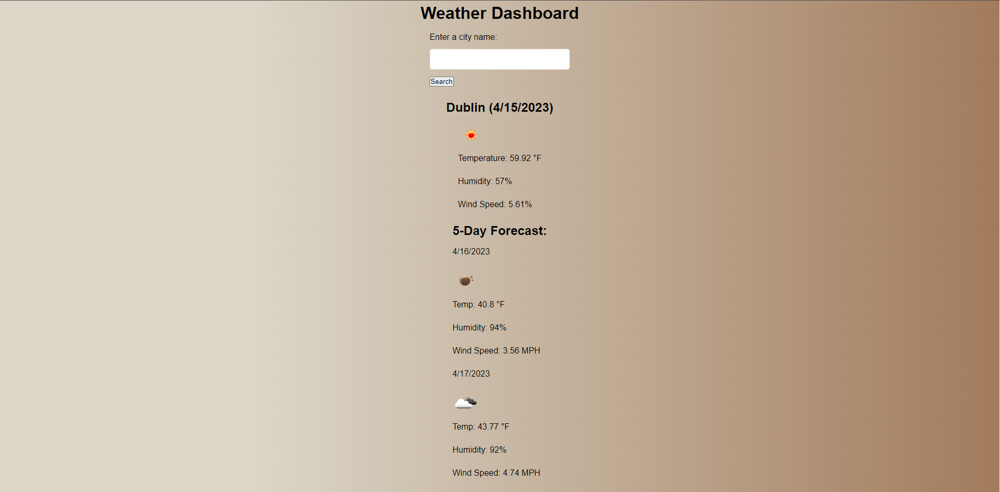

# Homework 6 Weather Dashboard

https://seafoodude.github.io/homework-6-weatherDash/

## Description

This Homework 6 Weather Dashboard was created for boot camp students who were going through Module 06. It contains a weather dashboard that holds the weather information for the current day and a five day forecast for the city inputted.

My motivation came from my desire to learn about web APIs and apply it in creating a weather dashboard.
I created this weather dashboard to show that I have learned and absorbed the information given to me through the Module 06 requirement from the UCLA coding bootcamp.
This helped me to achieve a foothold in adding more complex and functional web API programs in my future projects.
I learned how to install a web API and build a weather dashboard.

## Table of Contents 

- [Installation](#installation)
- [Usage](#usage)
- [Credits](#credits)
- [License](#license)

## Installation

N/A

## Usage

To use this Homework 6 Weather Dashboard, you can search for a city of choice, and the page will populate with the weather information for the current day and the next 5 days. The current day will display the weather conditions, city name, date, icon, temperature, humidity, and wind speed. The 5 day forecast will display the date, icon, temperature, humidity, and wind speed. The searched city will be saved into localstorage and displayed in a 'previous search' box.

**SCREENSHOTS**

## Credits

Credits to Emma, Patricia, Michael R, Shawn, and Bryan for being amazing and guiding me through this experience!

## License

Please refer to the LICENSE in the repo.